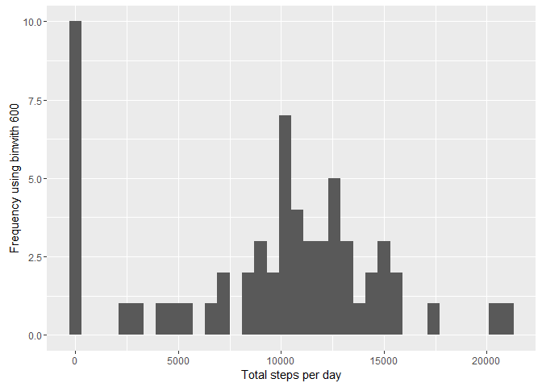
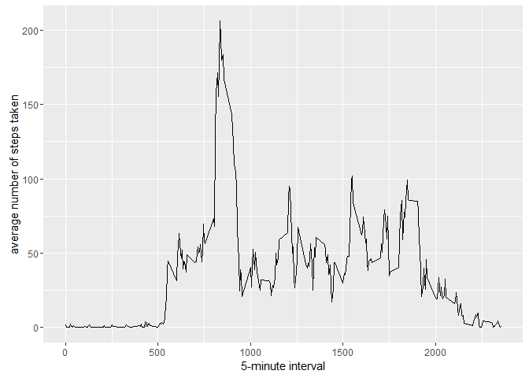
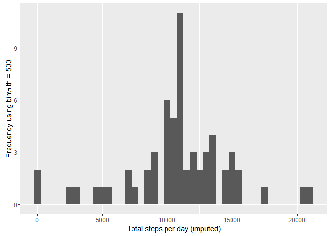
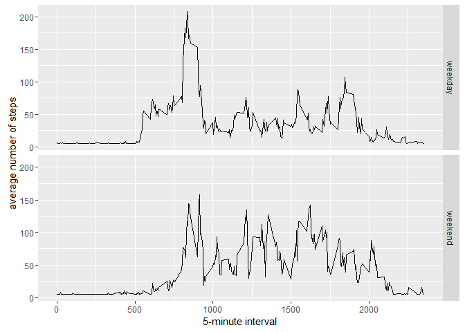

## Loading and preprocessing the data

1. #### Load the data (i.e. read.csv())


```r
if(!file.exists("activity.csv")){
   unzip("activity.zip")
}
activityData <- read.csv("activity.csv")
```


## What is mean total number of steps taken per day?


```r
stepsByDay <- tapply(activityData$steps, activityData$date, sum, na.rm = TRUE)
```
1. #### Make a histogram of the total number of steps taken each day


```r
library(ggplot2)
qplot(stepsByDay, xlab = "Total steps per day", ylab = "Frequency using binwith 600", binwidth = 600)
```



2. #### Calculate and report the mean and median total number of steps taken per day


```r
stepsByDayMean <- mean(stepsByDay)
stepsByDayMedian <- median(stepsByDay)
```
* Mean: r stepsByDayMean
* Median: r stepsByDayMedian


## What is the average daily activity pattern?


```r
averageSteps <- aggregate(x=list(meanSteps=activityData$steps), by=list(interval=activityData$interval), FUN=mean, na.rm=TRUE)
```

1. #### Make a time series plot


```r
library(ggplot2)
ggplot(data = averageSteps, aes(x=interval, y=meanSteps)) +
  geom_line()+
  xlab("5-minute interval") +
  ylab("average number of steps taken")
```



2. #### Which 5-minute interval, on average across all the days in the dataset, contains the maximum number of steps?


```r
mostSteps <- which.max(averageSteps$meanSteps)
timeMostSteps <- gsub("([0-9]{1,2})([0-9]{2})", "\\1:\\2", averageSteps[mostSteps, "interval"])
```

* Most steps at: r timeMostSteps


## Imputing missing values

1. #### Calculate and report the total number of missing values in the dataset (i.e. the total number of rows with NAs)


```r
MissingValues <- length(which(is.na(activityData$steps)))
```

* Number of missing values: r MissingValues


2. #### Devise a strategy for filling in all of the missing values in the dataset. The strategy does not need to be sophisticated. For example, you could use the mean/median for that day, or the mean for that 5-minute interval, etc

3. #### Create a new dataset that is equal to the original dataset but with the missing data filled in.


```r
library(Hmisc)
aDataImputed <- activityData
aDataImputed$steps <- impute(activityData$steps, fun=mean)
```

4. #### Make a histogram of the total number of steps taken each day


```r
stepsByDayimputed <- tapply(aDataImputed$steps, aDataImputed$date, sum)
qplot(stepsByDayimputed, xlab = "Total steps per day (imputed)", ylab = "Frequency using binwith = 500", binwidth=500)
```




4. #### and Calculate and report the mean and median total number of steps taken per day.


```r
stepsByDayMeanI <- mean(stepsByDayimputed)
stepsByDayMedianI <- median(stepsByDayimputed)
```

* Mean (Imputed): r stepsByDayMeanI
* Median(Imputed): r stepsByDayMedianI


## Are there differences in activity patterns between weekdays and weekends?


1. #### Create a new factor variable in the dataset with two levels -- "weekday" and "weekend" indicating whether a given date is a weekday or weekend day.


```r
aDataImputed$dateType <- ifelse(as.POSIXlt(aDataImputed$date)$wday %in% c(0,6), "weekend", "weekday")
```

2. #### Make a panel plot containing a time series plot 


```r
aveActivityDataI <- aggregate(steps ~ interval + dateType, data = aDataImputed, mean)
ggplot(aveActivityDataI, aes(interval, steps))+
  geom_line() +
  facet_grid(dateType ~ .)+
  xlab("5-minute interval")+
  ylab("average number of steps")
```



